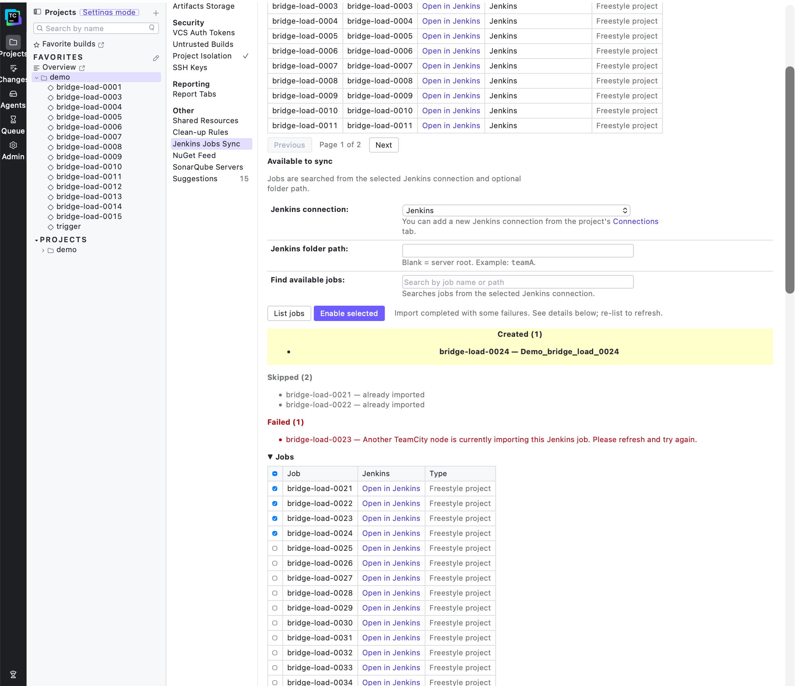
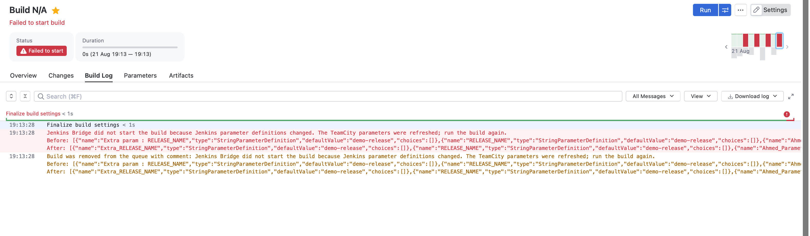

# Jenkins Bridge

Jenkins Bridge is a TeamCity server-side plugin that mirrors Jenkins builds into
agentless TeamCity builds.

For each Jenkins run, the plugin can:

- Create or restore the matching TeamCity build
- Stream Jenkins console output into the TeamCity build log
- Map Jenkins results such as SUCCESS, FAILURE, UNSTABLE, ABORTED, and NOT_BUILT to the TeamCity build outcome
- Import JUnit-style test results from Jenkins `testReport/api/json`
- Automatically register or reuse VCS roots and detect changes
- Copy Jenkins build parameters into TeamCity custom build parameters
- Automatically use Jenkins as artifact storage and display all published artifacts
- Persist mirror state in the internal TeamCity database for faster restart recovery

Pipeline support is also available for stage/log mirroring. Native TeamCity
build-chain mirroring is experimental and should be runtime-validated before it
is presented as a stable demo feature.

## Contents

- [Connecting to Jenkins](#connecting-to-jenkins)
- [Triggering Jenkins builds](#triggering-jenkins-builds)
- [Server settings](#server-settings)
- [State and recovery](#state-and-recovery)
- [Multi-node TeamCity support](#multi-node-teamcity-support)
- [Build and verification](#build-and-verification)
- [Install](#install)

## Connecting to Jenkins

A Jenkins server is configured as a project connection, under Project Settings >
Integrations > Connections > Add Connection > Jenkins. The connection includes the
display name, the Jenkins URL, the username, and that user's API token. A project
can hold several Jenkins connections, and connections are inherited by
subprojects.

To mirror a Jenkins job, visit the "Jenkins Jobs Sync" tab in the project admin
view. This screen will let you automatically create build configurations which have the
"Jenkins Bridge" build feature, letting the plugin know they are mirror targets.

The import page reports created, skipped, and lock-contention failures separately:



## Triggering Jenkins builds

An imported TeamCity build configuration is a TeamCity representation of one
Jenkins job. The TeamCity promotion is used as the user-facing build record,
but Jenkins remains the execution source of truth. When the Jenkins run is
created, the bridge binds it to the original TeamCity promotion and mirrors the
Jenkins data into that build.

### Before triggering

The following must already be true:

- A Jenkins connection is configured and accessible to the project.
- The Jenkins job has been imported through **Jenkins Jobs Sync**.
- The generated build configuration contains the **Jenkins Bridge** build
  feature and its Jenkins job, connection, and URL settings.
- The user queues the generated configuration through TeamCity's normal **Run
  Custom Build** flow.

The generated configuration is read-only by default through
`teamcity.ui.settings.readOnly=true`. This protects the generated configuration
from accidental edits, while still allowing users to queue it and provide run
parameters.

### End-to-end flow

1. **TeamCity creates a promotion.** The user queues the generated build
   configuration. TeamCity creates a normal queued promotion. The bridge's
   queue preprocessor marks this bridge-controlled build agentless before it is
   inserted into the queue. It records a versioned internal correlation payload containing the
   promotion ID, originating TeamCity node, request identity, timestamp, and Jenkins cause. It
   does not call Jenkins or write bridge state.

2. **The main node claims the trigger callback.** Every TeamCity node may
   observe the queue callback, but only the current TeamCity main node proceeds.
   A secondary node returns without calling Jenkins. This node gate is what
   prevents one TeamCity promotion from producing multiple Jenkins builds.

3. **The bridge checks whether the promotion should be skipped.** The callback
   is ignored when the build is already a bridge-generated mirror, when it has
   an internal `jenkins.build.key`, when it was triggered by the bridge itself,
   when it has no Jenkins Bridge feature, or when a pending trigger already
   belongs to the promotion.

4. **A provisional trigger record is persisted.** Before making the external
   Jenkins request, the listener stores a `PendingTrigger` containing the
   TeamCity promotion ID, TeamCity build type, Jenkins job, and Jenkins
   controller and cause marker. At this point the queue URL is empty and the queue ID is `-1`.
   This record marks the request boundary and protects the operation across a
   TeamCity restart or an ambiguous failure.

5. **Jenkins parameter definitions are refreshed.** The bridge reads the
   current Jenkins parameter definitions before every TeamCity-first trigger.
   Supported definitions are synchronized into the generated TeamCity
   configuration so changed defaults, types, choices, and deleted parameters
   are reflected in **Run Custom Build**. Only parameter names previously
   recorded as imported by this build configuration may be removed; TeamCity
   and bridge-owned parameters are preserved. The imported-name ownership set
   is stored in the bridge's shared state, not as a visible TeamCity parameter.

   As a mitigation for changes made between imports and user-triggered builds,
   the main-node poller also refreshes these definitions every
   `jenkins.bridge.parameterRefreshPollCycles` poll cycles (100 by default).
   This reduces the likelihood of stale parameters without replacing the
   trigger-time comparison and failed-to-start safeguard.

   Jenkins may briefly return the previous parameter definitions after a job configuration change, so the trigger-time safeguard remains necessary.

6. **The request parameters are constructed.** TeamCity default and custom
   values are combined, with custom values taking precedence. Internal bridge
   parameters are removed from the Jenkins request. The final payload contains
   only names currently declared by Jenkins; values not supplied by the user
   fall back to Jenkins defaults. Parameter names and values are URL-encoded
   before the Jenkins form request is sent.

7. **Jenkins is triggered once.** The bridge sends a POST to Jenkins
   `buildWithParameters` when the payload is non-empty, or to `build` when the
   job has no parameters. Jenkins authentication and CSRF crumb handling are
   performed by the configured Jenkins client. The cause is sent as Jenkins' `cause` query
   parameter, while build parameters remain in the form body. A queue item URL and numeric queue
   ID are preferred, but are not required because the same cause is also read from Jenkins build
   metadata.

8. **The pending record is resolved.** After a valid response, the provisional
   record is replaced with the returned Jenkins queue URL and queue ID. The
   main-node poller subsequently checks that queue item. While it remains
   queued, the record is retained. If Jenkins cancels the item, the TeamCity
   promotion is failed with the Jenkins cancellation reason and the
   pending record is removed.

9. **The Jenkins build is bound to the original promotion.** When the queue
   item exposes an executable build number, the bridge loads the Jenkins build
   and validates the controller, job, and queue ID. It then assigns the
   original TeamCity promotion to the `BuildMirror`, persists the relationship,
   and removes the `PendingTrigger`. The bridge never chooses an owner merely
   because a build is recent or has the expected build number.

10. **Live mirroring continues.** The normal main-node poll cycle synchronizes
   the bound Jenkins build. Freestyle jobs receive progressive console output;
   Pipeline jobs receive the stage-level data Jenkins exposes. Run-level
   parameters, tests, artifacts, VCS changes, summary data, and the final
   Jenkins result are mirrored according to Jenkins visibility. The TeamCity
   build is finished from the Jenkins terminal result.

Normal Jenkins build discovery runs independently of pending triggers. A build
that becomes visible immediately after triggering is matched by its Jenkins
queue ID before the per-job build-number watermark is applied, so it can still
be attached to the correct TeamCity promotion.

### Failure and recovery behavior

- If the bridge cannot prepare or persist the provisional record, it does not
  call Jenkins. The TeamCity promotion is recorded as a bridge failure.
- If Jenkins is called but the request fails, or Jenkins returns no usable queue
  URL/ID, the TeamCity promotion is recorded as an uncertain trigger failure.
  The user should check Jenkins before retrying because Jenkins may have
  accepted the request.
- A failed or ambiguous trigger is not blindly submitted again by the bridge.
  This prevents one TeamCity promotion from creating duplicate Jenkins runs.
- If queue resolution temporarily fails, the correlated pending record remains
  for the next poll. If it expires according to
  `jenkins.bridge.pendingTriggerTimeoutMinutes`, the promotion is failed with
  an explicit uncertain-trigger message.
- If the discovered Jenkins build is already owned by another TeamCity build,
  the existing owner is retained and the conflicting trigger is failed. The
  bridge does not replace the existing ownership.

When Jenkins parameter definitions differ from the stored snapshot, the bridge
refreshes TeamCity and marks the current promotion as **Failed to start** rather
than sending potentially outdated values to Jenkins. The build log contains the
exact definitions from before and after the refresh, and the user can retry with
the updated parameters:



The current implementation has one Jenkins-triggering writer: the main-node
queue listener. The main-node poller owns queue resolution, build discovery,
binding, and live synchronization. The separate technical design document
describes a future move of the Jenkins POST into the poller; that change is not
yet the behavior documented here.

## Server settings

The remaining settings are server-wide TeamCity internal properties. Configure
them in TeamCity's data-directory properties configuration. Changes require a
server restart to take effect.

| TeamCity internal property                    | Default               |
|-----------------------------------------------|-----------------------|
| `jenkins.bridge.enabled`                      | `true`                |
| `jenkins.bridge.pollSeconds`                  | `10`                  |
| `jenkins.bridge.parameterRefreshPollCycles`   | `100`                 |
| `jenkins.bridge.pendingTriggerTimeoutMinutes` | `1440`                |

## Storage, persistence, and pruning

Live bridge state is stored in TeamCity's root-project `CustomDataStorage`, backed
by the TeamCity database. Records are JSON values under separate storage-key
prefixes:

| Data | Purpose |
|---|---|
| `BuildMirror` | Active Jenkins-to-TeamCity synchronization state, including the Jenkins build key and sync status. |
| `BuildResultMetadata` | Historical result-page data, such as the Pipeline Graph. Keyed by TeamCity build ID and not used for polling. |
| `PendingTrigger` | TeamCity-first triggers waiting to be correlated with a Jenkins build. |
| `lastSeenBuildNumber` | Per-job Jenkins discovery watermark. |
| `lastPruned` | Per-mapping UTC boundary for builds removed by pruning. |
| Poll status | Last successful poll time and the last poll error. |

Pruning removes only finished `BuildMirror` records. On the main node, after a
successful poll, pruning checks the total mirror count. At 1,000 or fewer it
does nothing; above 1,000 it scans finished mirrors for mappings successfully
polled in that cycle. For selected mappings it persists `lastPruned`, copies
each mirror's result data to `BuildResultMetadata`, and removes the active mirror.

The `lastPruned` boundary prevents Jenkins builds at or before that timestamp
from being discovered again after a restart. Pruning therefore removes active
sync state without removing the TeamCity build's historical result metadata.
Metadata is removed when TeamCity deletes the corresponding build. The main-node
poll cycle also reconciles orphaned metadata every 100 cycles as a fallback.

Active sync state is temporary. When the total persisted mirror count exceeds
1,000, the main-node poll cycle scans and prunes finished records. The bridge
stores a per-mapping `lastPruned` UTC boundary and ignores Jenkins builds at or
before that boundary, so pruning cannot cause old builds to be mirrored again
after a restart.

Pipeline Graph result data is stored separately from active sync state. It stays
available while the TeamCity build exists and is removed when TeamCity cleanup
or build deletion removes that build. This keeps finished result pages usable
without retaining live log offsets and retry bookkeeping indefinitely.

The build feature's "No. of builds to import on first sync" setting controls only
defaults to 1 (only the newest Jenkins build). After the
first poll, discovery is incremental, and every new Jenkins build after the
stored watermark is considered. If Jenkins build numbers are reset or reused, the
bridge also uses the Jenkins build timestamp to identify the run.

## Multi-node TeamCity support

Jenkins Bridge supports a TeamCity main node and one or more secondary nodes when
all nodes use the same TeamCity data directory configuration and shared database.
Use PostgreSQL (or another supported external database) for a multi-node setup;
the internal HSQL database is intended for single-node development only.

Node responsibilities are split as follows:

- The main node runs Jenkins polling and the Jenkins-triggering orchestration.
- A mirrored TeamCity build can be triggered through a secondary node. The
  secondary node queues the TeamCity promotion, while the actual outbound
  Jenkins request is performed by the main node.
- Secondary nodes do not need a Jenkins connection for build triggering or
  mirroring. They only need Jenkins connection access when serving the Jenkins
  Jobs Sync import page.
- Jenkins job imports use a TeamCity database-backed distributed lock per project,
  Jenkins connection, and Jenkins job. If another node currently owns the lock,
  the import returns a retryable failure; refresh and try again.
- Build and trigger state is persisted in the shared TeamCity database so the main
  node can correlate work observed through another node.

Install the same plugin archive on every node and restart or reload the plugin on
each node after an upgrade. Verify the active node roles and plugin version in the
respective `teamcity-server.log` files before testing concurrent imports.

## Build and verification

Run unit tests from the repository root:

```bash
mvn test
```

### Pre-commit gate

Enable the repository-local hook once per checkout:

```bash
git config core.hooksPath .githooks
```

The hook checks staged whitespace and conflict markers, then runs
`mvn -pl jenkins-bridge-server test-compile` with compiler warnings enabled. It deliberately
targets the Java server module: the root `build` module only assembles the plugin archive and
requires the separate Maven `replacer` plugin setup. Archive packaging remains a separate
`mvn package` check. The hook also runs an optional `gitleaks` staged secret scan when `gitleaks`
is installed. Set `JENKINS_BRIDGE_MAVEN_REPO` when Maven should use an isolated local repository.

`mvn verify` additionally runs the database-backed TeamCity integration tests. Those
fixture tests require Java 21 because the current TeamCity test server still uses
the legacy Security Manager; the Maven profile enables the required Java 21 flag
automatically.

The default TeamCity API version is `2026.3-SNAPSHOT`, and Maven looks for its
artifacts under `${user.home}/.m2/repository/TeamCity`. Both values are
configurable, so plugin developers can build against a published TeamCity
version or a local TeamCity source build.

For a local TeamCity source build, point Maven at its `local-repo` directory:

```bash
mvn package \
  -Dteamcity-version=2026.3-SNAPSHOT \
  -Dteamcity-repository-url=file:///path/to/TeamCity/local-repo
```

If the selected TeamCity repository does not contain `license-protected` at the
same version, override that test-only dependency separately:

```bash
mvn test \
  -Dteamcity-version=2026.3-DSL-eap1-SNAPSHOT \
  -Dteamcity-license-version=2026.2-SNAPSHOT
```

### Persistent local Maven settings

Instead of passing these properties on every command, define them in a personal
Maven profile in `${user.home}/.m2/settings.xml`. Do not commit this file because
the repository path is machine-specific:

```xml
<settings>
  <profiles>
    <profile>
      <id>teamcity-local</id>
      <properties>
        <teamcity-version>2026.3-SNAPSHOT</teamcity-version>
        <teamcity-repository-url>file:///path/to/TeamCity/local-repo</teamcity-repository-url>
        <teamcity-license-version>2026.3-SNAPSHOT</teamcity-license-version>
      </properties>
    </profile>
  </profiles>
  <activeProfiles>
    <activeProfile>teamcity-local</activeProfile>
  </activeProfiles>
</settings>
```

After that, the normal command uses the configured version and repository:

```bash
mvn package
```

For a repository where `license-protected` is only available from another
TeamCity line, change only `teamcity-license-version` in this personal profile.

The latest plugin archive is written to:

`target/jenkins-bridge.zip`

The build also keeps timestamped Git-SHA archives such as:

`target/jenkins-bridge-20260608123456-2d8bab4.zip`

## Install

Copy `target/jenkins-bridge.zip` into the TeamCity data directory's `plugins`
folder, then restart TeamCity.
